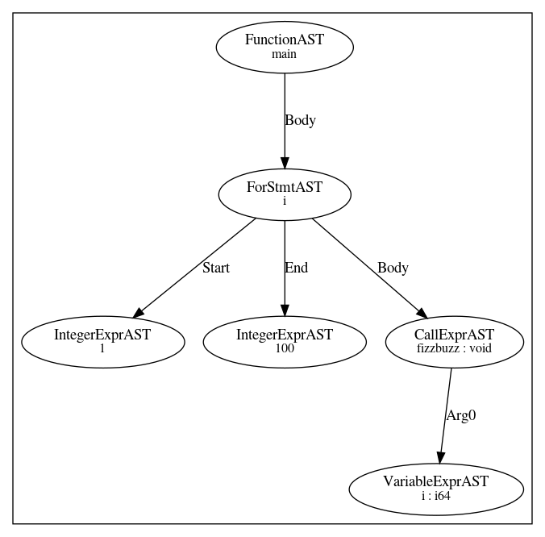

Contra is both an interpreter and a compiler.  As an interpreter, it can be used interactively, or to execute a program.  To see a list of command line options,

    ./contra --help

    Usage: ./contra [--compile,-c] [--debug,-g] [--dump-ir,-i IR_FILE] [--dump-dot,-d DOT_FILE] [--force,-f] [--help,-h] [--optimize,-O] [--output,-o OUTPUT_FILE] [--verbose,-v] [SOURCE_FILE]

        --compile:       Compile provided SOURCE_FILE.
        --debug:         Turn off optimizations.
        --dump-ir:       Dump IR.
        --dump-dot:      Dump AST.
        --force:                 Overrite output files.
        --help:          Print a help message.
        --optimize:      Optimize.
        --output:        Output object file to OUTPUT_FILE.
        --verbose:       Print debug information.

It is recommended to use Contra to interpret a script right now.  For example,

    ./contra ../examples/contra/00_hello_world/hello.cta

Intermediate Representation
---------------------------
To see the IR generated by LLVM,

    ./contra -i- ../testing/hello.cta

Or it can be dumped to a file

    ./contra -ihello.ll ../examples/contra/00_hello_world/hello.cta

A sample of the output is provided below:

````
define void @__anon_expr() {
entry:
  call void (i8*, ...) @print(i8* getelementptr inbounds ([14 x i8], [14 x i8]* @0, i32 0, i32 0))
  ret void
}
````

Note that contra will not overwrite previously dumped files.  Use `-f` to force overwriting.

Graphical AST
-------------
You can visualize AST graph using the DOT language and something like Graphviz.  For example,

    ./contra -igraph.dot ../examples/contra/00_hello_world/hello.cta

Will dump the AST to a file called `graph.dot`.  This can be vizualized with xdot,

     xdot  graph.dot


